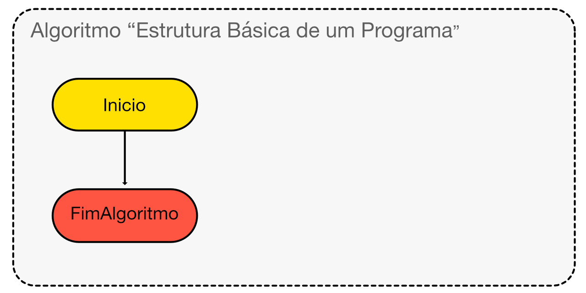

# Survival with Pseudo Code
> BootCamp Visualg 2.5
> Portuguese version of the Pseudo Code

1. Basico
    manual, projetos e desafios
2. Intermediario
    manual, projetos e desafios
3. Avancado
    manual, projetos e desafios
4. Mestre
    manual, projetos e desafios

## Bloco de Codigo Funcional (spring)
> A atual apostila utilizara a metodologia diagrama de fluxo e micro codigos para explicacao do comando ou bloco de codigo
### Spring, Funcionalidade vs Bug
 - [X] Diagrama de Fluxo
 - [X] Algoritmo em Visualg

## Projetos
> Outrossim, criacao de miniprojetos com software completos:
### Briefing &nbsp;
- [X] Levantamento de requisitos &nbsp;
- [X] Construção da marca &nbsp;
### Modelagem do Sistema &nbsp;
- [X] Diagramas UML &nbsp;
### Design UI e UX &nbsp;
- [X] Proposta GUI OU CLI &nbsp;
- [X] Principios de UX &nbsp;
- [X] Prototipo do Software &nbsp;
### Etapas de Desenvolvimento &nbsp;
- [X] pilha de Spring  &nbsp;
  - [X] descricao da funcionalidae &nbsp;
  - [X] diagrama caso de uso e diagrama de flux &nbsp;
  - [X] funcionalidade vs bug &nbsp;
### Teste Q&A &nbsp;
- [X] Teste de Entrada e Saida de Dados &nbsp;
- [X] Verificação das regras de negocio atendidas &nbsp;

## `Básico`
> ### Introdução a Progamação
>
>Programar é compreender uma situação-problema junto de uma resolução, e posteriormente ter habilidades para ensinar o computador a solucionar este caso.  
>
> Para isso transformamos o caso em dados e manipulamos esses dados em forma de ordem (comandos) ate obter o resultado desejado.

### Escrevendo meu primeiro programa

> Agora vamos utilizar o interpretador visualg, que esta na pasta deste repositorio: `visualg.exe`
> - utilize um computador com windows 7 ou maior
> - utilize o emulador wine no linux ou macOS

~~~ alg
Algoritmo "Estrutura Básica"
Inicio

FimAlgoritmo
~~~

### Os Tipos de Dados Simples

Os tipos  de dados básicos são do tipo numericos (inteiro e decimais), textuais ( caracteres, ou conjunto de caracteres) e logicos (verdadeiro ou falso). `inteiro`, `real`, `caractere`, `logico`

### As variaveis e seus Tipos de Dados

Um programa precisa guardar e manipular os dados, por isso trabalha-se com a criação de espaços que armazenam um tipo de dado especifico.
Existem casos que precisamos guardar dados como a idade de alguem (numeros inteiros), saber quantos quilomentos foram caminhados hoje (numeros decimais). Assim, vamos trabalhar com variáveis.

~~~ alg
Algoritmo "Tipo Simples Dados"

Var
  numero_inteiro: inteiro
  numero_decimal: real
  lampada_ligada: logico
  cliente_genero: caractere
  
Inicio
FimAlgoritmo
~~~

### Inserir dados com `<-` & `leia()`

Para inserir dados dentro de um programa podemos utilizar a atribuição de valores a variaveis.

> Utilizando com a atribuicão de valores `<-`

~~~ alg
algoritmo "atribuindo dados a variaveis"
  
  var
    numero_inteiro : inteiro
    numero_decimal : real
    lampada_ligada : logico
    cliente_genero : caractere

  inicio
    numero_inteiro <-  1 
    numero_decimal <-  3.14 
    lampada_ligada <-  verdadeiro 
    cliente_genero <-  "f" 
fimalgoritmo
~~~

> Tambem utiliza-se o comando `leia(varaivel)`

~~~ alg
algoritmo "atribuindo dados a variaveis"
  
  var
    numero_inteiro : inteiro
    numero_decimal : real
    lampada_ligada : logico
    cliente_genero : caractere

  inicio
    leia(numero_inteiro)
    leia(numero_decimal)
    leia(lampada_ligada)
    leia(cliente_genero)

fimalgoritmo
~~~

### Mostrando dados na tela com `escreva()` & `escreval()`

Para saida de dados na tela do computador, utilizamos o comando `escreva(variavel)`
  
~~~ alg
algoritmo "atribuindo dados a variaveis"
  
  var
    numero_inteiro : inteiro
    numero_decimal : real
    lampada_ligada : logico
    cliente_genero : caractere
  
  inicio
    numero_inteiro <-  1 
    numero_decimal <-  3.14 
    lampada_ligada <-  verdadeiro 
    cliente_genero <-  "f" 

    escreva(numero_inteiro)
    escreva(numero_decimal)
    escreva("Lampada do Quarto? ", lampada_ligada)
    escreva("Genero: ", cliente_genero)

fimalgoritmo
~~~

> Uma variação do comando escreva é o `escreval(variavel)`. Que mostra o valor em uma nova linha 

~~~ alg
algoritmo "mensagem na tela"

  inicio
    escreval("Ola, eu sou uma  mensagem de texto")

fimalgoritmo
~~~

### Criação de Algoritmos

Como visto acima um programa e tipo como conjunto de comando em ordem logica e coerente. Por isso para criar progamas de computadores utiliza-se os algoritmos, que são passos pre estabelecidos e que produzem uma ação desejada, um resultado esperado.

### Sequencia de Execução

Para isso, os programas utilizam uma sequencia de execução. por hora este fluxo seque linha por linha, se não houver algum desvio ( **pratica adotada na programação estruturada** ). mas isso e para outro momento, por enquanto nosso fluxo sera em sequencia de execução, linha a linha.

### Projeto de construção de programa simples IO
  
  #### Tipos de dados e atribuicao de dados
  
  > vamos criar um progama que armazena genero e a idade de uma pessoa

~~~ alg
algoritmo "nome e idade"

  var
    genero_pessoa: caractere
    idade_pessoa: inteiro

  inicio
    genero_pessoa <- "f"
    idade_pessoa <- 18

fimalgoritmo
~~~

  #### Tipos de dados e escrevendo com o teclado
  
  > Nosso proximo programa registrar numero de pessoas no onibus

~~~
algoritmo "lotação do onibus"

  var
    numero_passageiros : inteiro
  
  inicio
    leia(numero_passageiros)

fimalgoritmo
~~~

  #### Tipos de dados e exibindo mensagem e dados na tela

  > Nosso programa ira exibir uma mensagem na tela de boas vindas!

~~~
algoritmo "mensagem na tela"

  var
  
  inicio
    escreva("Ola!")
    escreval("Bem Vindo ao meu programa.")
    
fimalgoritmo
~~~ 

  #### Juntando Todo o Conhecimento
  
  > Nosso programa ira registrar a temperatura e Escreva uma mensagem na tela com a temperatura 

~~~
algoritmo "medindo a temperatura"

  var
    temperatura_ceusius : real

  inicio
    escreva("Digite a Temperatura do Dia: ")
    leia(temperatura_ceusius)

    escreval("Temperatura Atual", temperatura_ceusius)
    
fimalgoritmo
~~~

  #### Projeto Final

  > Nosso programa ira registrar os dados pessoais de alguem que voce conheceu na festa de ontem

~~~
algoritmo "contato da festa"

  var
    idade: inteiro
    numero_celular: inteiro

  inicio

    escreva("Registrar o Celular: ")
    leia(numero_celular)
    
    escreval("Contato Da Festa de Ontem: ")
    escreva("Oi, sou Ursula !","Lige para #",numero_celular)

fimalgoritmo
~~~

## `Intermediario`
> Agora, neste estagio de desenvolvimento de programas iremos abordar a manipulacao de dados e iremos apresentar a programacao estruturada, que  segue possue dentre suas vantagem a capacidade de alterar o fluxo de execucao com os teste comparativos.

### Operadores Unarios `+` & `-`

se escrevermo `-3` torna o numero e negativo. mas se escrevermos `+3` o numero continua sendo positivo, nao sofrendo nenhuma alteracao.  

~~~ alg
algoritmo "operador unario + -"

  var
    numero_inteiro : inteiro

  inicio
    numero_inteiro <- -4
    numero_inteiro <- +4

    escreval(numero_inteiro)

fimalgoritmo
~~~

### Operadores Aritmericos

Os Operados basicos em visualg, são `adição +`, `subtração -`, `multiplicação *` e ` divisãos /`

> SOMA

~~~ alg
algoritmo "Operador Soma"

  var
    num_01: inteiro
    num_02: inteiro
  
  inicio
    escreval("Digite Um numero Inteiro")
    leia(num_01)
    
    escreval("Digite outro numero Inteiro")
    leia(num_02)

    escreval("soma:", num_01 + num_02)

fimalgoritmo
~~~

> SUBTRAÇÃO

~~~ alg
algoritmo "Operador Subtração"

  var
    num_01: inteiro
    num_02: inteiro
  
  inicio
    escreval("Digite Um numero Inteiro")
    leia(num_01)
    
    escreval("Digite outro numero Inteiro")
    leia(num_02)

    escreval("subtração", num_01 - num_02)

fimalgoritmo
~~~

> MULTIPLICAÇÃO

~~~ alg
algoritmo "Operador Multiplicação"

  var
    num_01: real
    num_02: real
  
  inicio
    escreval("Digite Um numero Decimal")
    leia(num_01)
    
    escreval("Digite outro numero Decimal")
    leia(num_02)

    escreval("multiplicacão", num_01 * num_02)

fimalgoritmo
~~~

> Disivão

~~~ alg
algoritmo Operador Divisão"

  var
    num_01: real
    num_02: real
  
  inicio
    escreval("Digite Um numero Decimal")
    leia(num_01)
    
    escreval("Digite outro numero Decimal")
    leia(num_02)

    escreval("divisao", num_01 / num_02)

fimalgoritmo
~~~

### Divisão Com Resultado Inteiro `\`
Operador de divisao que exibe o resultado somente em sua forma inteira, excluindo a parte decimal.

~~~ alg
algoritmo "Resulado Inteiro da Divisão"

  var
    num_01 : inteiro
    num_02 : inteiro
    resultado : real

  inicio
    num_01 <- 8
    num_02 <- 3

    resultado <- num_01 / num_02
    escreval("Resultado Decimal:", resultado)

    resultado <- num_01 \ num_02
    escreval("Resultado Inteiro: ",resultado)

fimalgoritmo
~~~

### Resto que não pode ser Dividido: `MOD` ou `%`
O Operador do modulo, apresenta o valor que não pode ser divido, pode ser construido de duas formas: `8 MOD 3` ou `8 % 3`

~~~ alg
algoritmo "parte indivisivel"

  var
    num_01 : inteiro
    num_02 : inteiro
    resultado: real
    parte_indivisivel: inteiro

  inicio
    num_01 <- 7
    num_02 <- 3

    resultado <- num_01 / num_02
    escreval("Divisao Decimal", resultado)

    resultado <- num_01 \ num_02
    escreval("Divisao Inteira: ", resultado)

    parte_indivisivel <- num_01 % num_02
    escreval("MOD: ", parte_indivisivel)
fimalgoritmo
~~~

#### Resolvendo potencias em pseudo codigo `^`

Para fazer potencias em pseudo codigo utilizamos a seguinte estrutura de codigo `5 ^ 2`

~~~ alg
algoritmo "Operador de Potenciacao"

  var
    numero: inteiro
    base: inteiro
    resultado: real

  inicio
    numero <- 7
    base <- 2

    resultado <- numero ^ base
    escreval(numero,"^",base, ": ", resultado)

fimalgoritmo
~~~

### operadores logicos e Relacionais
Os operadores logicos em visalg funcionan com a logica booleana e possue os seguintes

|**SIMBOLO**  |**OPERADOR**|
| :---        | :---       |
|`=`| igual     | 
|`<>`| diferente  | 
|`<` | menor      | 
|`>` | maior      | 
|`<=`| menor igual| 
|`>=`| maior igual| 

~~~ alg
algoritmo "Tamanho do Tanque de Gasolina"

  var
    carro: inteiro
    moto: inteiro
    resposta : logico

  inicio
  escreval("Litros de Gasolina")
  escreval("Carro Vs Moto")
  carro <- 400
  moto <- 20
  
  resposta <- carro = moto
  escreval("Carro Igual Moto? ", resposta)

  resposta <- carro <> moto
  escreval("Carro Diferente Moto? ", resposta)
  
  resposta <- carro < moto
  escreval("carro menor moto", resposta)

  resposta <- carro > moto
  escreval("carro maior moto", resposta)

  resposta <- carro <= moto
  escreval("carro menor igual moto", resposta)

  resposta <- carro >= moto
  escreval("carro maior igual moto", resposta)

fimalgoritmo
~~~

|**SIMBOLO**  |**OPERADOR**| **DESCRIÇÃO**|
| :---        | :---       | :--- |
|NOT | `nao` | inverte o valor logico, tornando verdadeiro em falso ou falso em verdadeiro|
|OR  | `ou`  | utilizado em dois casos onde se somente um deles for verdadeiro, entao sera verdade|
|AND | `e`   | utilizado em dois casos onde todos os casos precisam ser verdadeiro para que seja verdadeiro|
|XOR | `xou` | retorna veradeiros se os operadores forem iguais, 2 verdadeiros ou 2 falsos. se forem verdadeiro e falso a resposta sera falsa|

~~~ alg
algoritmo "comparando afirmacoes verdadeiras"

  var
    chover : logico
    guarda_chuva : logico
  inicio
  
  chover <- verdadeiro
  guarda_chuva <- falso
  
  escreval(chover ou guarda_chuva)
  escreval(chover e guarda_chuva)

  nao guarda_chuva

  escreval(chover xou guarda_chuva)
  
fimalgoritmo
~~~

### Estrutura de Decisao
> Para realizar testes comparativos podemos utilizar a estrutura de desição condicional `se`
#### Condicional `se`

~~~ alg
algoritmo "saque bancario"
  
  var
    saque : real
    saldo : real

  inicio
  saldo <- 100
  
  escreval("Saldo:",saldo)
  escreval("Valor para saque? ")
  leia(saque)

  se saque <= saldo entao
    saldo <- saldo - saque
    escreval("saque realizado com sucesso")
  fimse

  escreval("Saldo: ", saldo)
fimalgoritmo
~~~

#### Condicional com 2 Opções `se`, `senao`
> Para compara duas situações temos a estrutura se, senão

~~~ alg
algoritmo "dia quente? dia frio?"
  var
    temperatura : real
  inicio

    escreva("Qual a Temperatura?")
    leia(temperatura)

    se temperatura > 30 entao
      escreval("Dia Quente")
    senao 
      escreval("Dia Frio")
    fimse

fimalgoritmo
~~~

> Podemos criar sequencias condicionais com 3 ou mais opçoes, contudo se for 4 ou acima o codigo começa a ficar confuso e para isso podemos utilizar outra estrutura. vamos ver com 3 opçoes de condição.

~~~ alg
algoritmo "desconto de tres tipos"
  var
    valor : real

  inicio
    
    escreval("Qual o valor do Produto?")
    leia(valor)

    se valor > 100 entao
      escreval("desconto 25%")
    senao
      se valor > 75 entao
        escreval("desconto 15%")
      senao
        escreval("desconto 10%")
      fimse
    fimse

fimalgoritmo
~~~

#### Condicional com Categoria `escolha`

> Podemos utilizar o codigo `escolha` em situações onde tempos categorias ou casos

~~~ alg
algoritmo "estações do ano apartir do mes"
  
  var
    mes : inteiro
  inicio

    escreval("Qual o Mes, em numero?")
    leia(mes)

    escolha mes

      caso 12, 1, 2, 3
        escreva("verao ")
      caso 3, 4, 5 ,6
        escreva("outono")
      caso 6, 7, 8 , 9
        escreva("inverno")
      caso 9, 10, 11, 12
        escreva("primavera ")
      outrocaso
        escreva("nao sei")
    fimescolha

fimalgoritmo
~~~

### Estrutura de Repetição 
As estrutura de repetição servem para casos onde e necessaro fazer incremento, decremento ou percorrer valores em uma lista de opcoes

#### Repita Ate

> Este comando repete ate que a condicao seja realizada

~~~ alg
algoritmo "restaurante da chinesa"
  
  var
    prato_comida : inteiro
  inicio
    prato_comida <- 10

    repita
      escreval("coomida servida!", prato_comida)
      prato_comida <- prato_comida - 1

    ate prato_comida = 0

    escreval(prato_comida)

fimalgoritmo
~~~

#### enquanto 

> o comando enquando testa a condicao  e realiza a operação, pode ser execultado `0 ou n vezes`

~~~ alg
algoritmo "restaurante da chinesa"
  var
    prato_comida : inteiro

  inicio
    prato_comida <- 10

    enquanto prato_comida > 0 faca
      escreval("Comida Servida!", prato_comida)
      prato_comida <-  prato_comida - 1
    fimenquanto

    escreval(prato_comida)

fimalgoritmo
~~~

#### Estrutura Para Valor de inicio ate fim
> A estrutura para e utilizada quando se tem o numero exato de repeticoes a se fazer, e utiliza-se uma variavel de controle e um incrementador e um acumulador da iteração.

~~~ alg
algoritmo "garrafas vazias"

  var
    garrafa : logico
    vazias : inteiro
    tarefa : inteiro
    
  inicio

    escreval("Quantas garrafas vazias?")
    leia(vazias)
    
    para tarefa de 1 ate vazias passo 1 faca
      garrafa <- verdadeiro
      escreval("Garrafa",tarefa," cheia?: ", garrafa)
    fimpara

fimalgoritmo
~~~

> Sequencia Fibonacci com `Para`!
~~~ alg

~~~

> contragem regressiva e progressiva com `para`

~~~ alg

~~~

### Procedimento e Escopo de variaveis
O procedimento e um bloco de codigo com uma finalizade espeficica, pode ser chamado tambem como subrotina e este recurso produz um respota que não sera utilizado no programa principal, sua finalidade encerra em si mesmo, ou seja ele recebe dados e nao fornece retorno de dados para o bloco de codigo principal. por isso podemos utilizar variaveis globais, ponteiros para guardar os dados fora do procedimento ou passagem de valores e variaveis locais para processar os dados e exibir os resultados dentro do procedimento, sem persistencia de dados (salvar para o bloco de codigo principals)

> #### Variaveis Globais; 
  No uso de procedimentos uma abordagem e a utilizacão das variaveis globais, o exemplo abaixo cria a variavel `estoque_coca` e essa variavel e alterada passando porque sua visualizacao e global. retornando valores para o bloco principal atraves da variavel global

~~~ alg
algoritmo "Estoque de Coca Cola"

  var
    estoque_coca : inteiro
    
    procedimento BebeCocaCola
      inicio
        estoque_coca <- estoque_coca - 1
    fimprocedimento

    procedimento MostrarEstoqueCoca
      inicio
        escreva("Ver todas as minhas Coca Cola? ")
        escreval(estoque_coca)
    fimprocedimento

  inicio
    estoque_coca <- 25
    
    MostrarEstoqueCoca
    BebeCocaCola

    MostrarEstoqueCoca

fimalgoritmo
~~~

> #### Passagem Do Endereço de Memoria (ponteiros);
  outra abordagem e a utilização do codigo `var` na frente da variavel para receber o endereco da variavel e nao o valor. O exemplo a baixo cria uma variavel global `base_inimiga` e no procedimento `var local_base` recebe o endereço da memoria. retornando valores para o bloco principal atraves do ponteiro

~~~ alg
algoritmo "Atacar Base Inimiga"
  
  var
    base_inimiga : logico

    procedimento JogarBomba (var local_base: logico)
      inicio
        escreval("Bomba Jogada!")
        local_base <- verdadeiro
    fimprocedimento

    procedimento EstadoBase (var local_base : logico)
      inicio
        escreval("Base Inimiga Destruida? ", local_base)
    fimprocedimento

  inicio

    escreval("Star War")
    EstadoBase(base_inimiga)

    JogarBomba(base_inimiga)
    EstadoBase(base_inimiga)

fimalgoritmo
~~~

> #### Variaveis Locais e uso de passagem de parametros (valores e variaveis) sem retorno para o bloco principal;

~~~ alg
algoritmo "Converter pixel em Inch"

  var
    medida_pixel : real

    procedimento ConverterEmPolegada(medida : real)
      inicio
        medida <- medida * 0.010416666666667 
        escreval("Inch:", medida)
    fimprocedimento

  inicio

    escreval("Qual Tamanho da tela? Pixel: ")
    leia(medida_pixel)

    ConverterEmPolegada(medida_pixel)

fimalgoritmo
~~~

### Juntando Todo o Conhecimento
  > criando dados, interacao com o usuario, manipulando os dados  atraves de operadores aritimeticos, operadores logicos, alterando o fluxo de dados e criando subrotinas.

  > criando menu com procedimento
  
~~~ alg
algoritmo "menu de opções"

  var
    sair : logico
    escolhido : inteiro

    procedimento TelaInicial
      inicio
        escreval("Caso [1], Caso [2], Caso [3], Caso [4], Sair [0]")
    fimprocedimento

    procedimento ModulosPrograma (escolhido : inteiro)
      inicio
        LimpaTela
        escolha (escolhido)
          caso 1
            escreval("> 1")
          caso 2
            escreval("> 2")
          caso 3
            escreval("> 3")
          caso 4
            escreval("> 4")
          outrocaso
            escreval("> Nao Sei")
        fimescolha
    fimprocedimento

    inicio
      repita
        TelaInicial
        leia(escolhido)

        se escolhido = 0 entao
          sair <- verdadeiro
          escreval("Finalizando o Programa")
        senao
          ModulosPrograma(escolhido)
        fimse

      ate sair = verdadeiro
fimalgoritmo
~~~

### Projeto de construção de programas completos
  >  Projeto Final Completo
  > #### Banco Hirão!
  ~~~ alg
algoritmo "Banco Hirão"

  var
    menu : inteiro
    saldo_conta : real

    procedimento Saldo (var conta: real)
      inicio
        escreval("Saldo: ", conta)
    fimprocedimento

    procedimento Saque (var conta : real)
      var 
        valor : real
      inicio
        escreva("Valor para Saque?")
        leia(valor)
        se valor > conta entao
          escreval("pobre nao pode gastar")
        senao
          conta <- conta - valor
          escreval("-", valor, " Sobrou", conta)
        fimse
    fimprocedimento

    procedimento Deposito ( var conta: real)
      var
        valor : real
      inicio 
        escreva("Valor para Deposito?")
        leia(valor)
        conta <- conta + valor
        escreval("+", valor, " Fortuna:", conta)
    fimprocedimento

    procedimento TelaInicial
      inicio
        escreval("Banco Hirão")
        escreval("Saldo [1], Saque [2], Deposito [3], Sair [0]")
    fimprocedimento

    procedimento ModulosPrograma (escolhido : inteiro; var dinheiro : inteiro)
      inicio
      LimpaTela
      escolha (escolhido)
        caso 1
          Saldo(dinheiro)
        caso 2
          Saque(dinheiro)
        caso 3
          Deposito(dinheiro)
        outrocaso
          escreval("nao sei")
      fimescolha
    fimprocedimento

  inicio
    menu <- 0
    saldo_conta <- 0

    repita
      TelaInicial    
      leia(menu)

      se menu = 0 entao
        escreval("saindo do banco")
        interrompa
      senao
        ModulosPrograma(menu, saldo_conta)
      fimse

    ate falso
fimalgoritmo
  ~~~

## `Avançado`

> Agora iremos iniciar um novo estagio na programação aprendendo a manipular os complexo com muita maestria

### Tipo de dados compostos

~~~ alg
algoritmo "criando vetor"
  var
    trem : vetor [1..10] de logico
    fila_banco : vetor [1..7] de inteiro

  inicio    

fimalgoritmo
~~~

### manipulando Dados Compostos

~~~ alg
Algoritmo "criando vetor"
  Var
    trem : vetor [1..10] de logico
    busca : inteiro

  Inicio

  busca <- 1
  Enquanto busca <= 10 FACA
    trem[busca] <- verdadeiro
    busca <- busca + 1
  FimEnquanto

FimAlgoritmo
~~~
~~~ alg
Algoritmo "Criando Vetor de Caracteres"
  Var
    letra        : caractere
    palavra      : caractere
    frase        : caractere
    post_twitter : caractere

  Inicio
    letra <- "c"
    palavra <- "goiaba"
    frase <- "eu sou a lenda"
    post_twitter <- "ola, eu sou uma postagem no twitter!"

FimAlgoritmo
~~~

### Manipulando vetores com procedimentos
> nao e possivel fazer a passagem do ponteiro de um vetor em visualg
> `procedimento ponteiro (var vetor [1..10] de inteiro)`

~~~ alg
Algoritmo "Vetores Global com Procedimentos"
  Var
    fila_objetos : vetor [1..10] de inteiro

    Procedimento AlimentarVetor
      Var
        item : inteiro
      Inicio
        Para item de 1 Ate 10 Passo 1 Faca
          fila_objetos[item] <- item
        Fimpara
    FimProcedimento

    Procedimento MostraVetor
      Var
        item : inteiro
      inicio
        item <- 1
        Enquanto item <= 10 Faca
          Escreval(fila_objetos[item])
          item <- item + 1
        FimEnquanto
    FimProcedimento
    
  Inicio
    AlimentarVetor()
    MostraVetor()

FimAlgoritmo
~~~
### Matriz Com Procedimentos
~~~ alg
Algoritmo " matriz - Caixa Organizadora"

  Var
    caixa : vetor [1..3,1..3] de inteiro
    
    Procedimento EncherCaixa
      Var
        linha, coluna : inteiro
        item : inteiro
      Inicio
        Para linha de 1 Ate 3 Faca
          Para Coluna de 1 Ate 3 Faca
            Escreva("Incluir[",linha, coluna,"] o Numero?")
            Leia(caixa[linha,coluna])
          FimPara
        FimPara
    FimProcedimento

    Procedimento MostrarCaixa
      Var
        linha, coluna : inteiro
        item: inteiro
      Inicio
        Para linha de 1 Ate 3 Faca
          Para coluna de 1 Ate 3 Faca
            Escreva(caixa[linha,coluna])
          FimPara
            Escreval("")
        FimPara
    FimProcedimento

  Inicio
    Escreval("Bem Vindo a minha Caixa!")
    EncherCaixa()
    MostrarCaixa()
FimAlgoritmo
~~~

### Funcao e Retorno de Tipo de Dados
> Funcao com retorno e sem parametros

~~~ alg
Algoritmo "Funcao retorna numero inteiro"
  Var
    resposta : inteiro

    Funcao NumeroInteiro : inteiro
      Var
        numero : inteiro
      Inicio
        Escreval("Digite Um Nunmero!")
        Leia(numero)
        Retorne numero
    FimFuncao
    
  Inicio
    resposta <- NumeroInteiro()
    Escreval("Retorno da Funcao? ", resposta)
FimAlgoritmo
~~~

> Funcao com retorno e parametros por valores e parametros por referencia `ponteiros`

~~~ alg
Algoritmo " Soma Com Parametros"
  Var
    numero_x : real
    numero_y : real
    resultado : real

    Funcao SomarNumeros(x, y : real) : real
      Inicio
        Retorne x + y
    FimFuncao
    
    Procedimento InserirNumeros( var x,y : real)
      Inicio
        Escreval("Insira valo de x e y:")
        Leia(x)
        Leia(y)
    FimProcedimento
    
  Inicio
    InserirNumeros(numero_x, numero_y)
    resultado <- SomarNumeros(numero_x, numero_y)
    EscrevaL("Somatorio: ", resultado)
FimAlgoritmo
~~~
> funcao com retorno logico

~~~ alg
Algoritmo "Funcao Com Retorno Logico"
  Var
    saldo : real
    valor : real
    saque : logico

    Funcao SaqueConta(var em_conta :real; sacar : real) : logico
      Inicio
        Se em_conta < sacar Entao
          Retorne Falso
        Senao
          em_conta <- (em_conta - sacar)
          Retorne Verdadeiro
        FimSe
    FimFuncao

  Inicio
    saldo <- 1000
    Escreval("Na Conta:", saldo)
    
    Escreva(" - Sacar? ")
    Leia(valor)
    saque <- SaqueConta(saldo,valor)
    EscrevaL(saldo ," | Saque?: ", saque)
FimAlgoritmo
~~~

### Recusividade de Funcoes e Aplicabilidade
> recursividade e a capacidade da funcao ou procedimento chamar a si mesmo.
> porem e um recuso de consome muito dados na memoria limitada do computador. 
> iremos apresentar a recusividade tradicional, e a recusividade em cauda (utiliza uma funcao auxiliar).
Ex. fatorial, fibonacci, torre hanoi, (percorrer vetor e matriz (incremento e decremento - contagem regressiva e progressiva) )

>#### recursividade tradicional

> Fatorial Recursivo 

~~~ alg
Algoritmo "Fatorial Recursivo"
  
  Var
    fatorial : inteiro
    Funcao FatorialRecursivo (numero : inteiro) : inteiro
      Var
        fatorial_parcial : inteiro
      Inicio
        Se numero <= 2 Entao
          Retorne numero
        Senao
          fatorial <- numero * (numero -1)
          Retorne fatorial
        FimSe
    FimFuncao

  Inicio
    fatorial <- FatorialRecursivo(34)

FimAlgoritmo
~~~

> Contagem Regressiva Recursiva

~~~ alg
Algoritmo "Contagem Regressiva Recursiva"

    Funcao ContagemRegressiva(numero : inteiro) : inteiro
      Var
      Inicio
        Se numero = 1 Entao
          Retorne numero
        Senao
          Escreval(numero)
          Retorne ContagemRegressiva(numero - 1)
        FimSe
    FimFuncao

  Inicio
    Escreval(ContagemRegressiva(10))
FimAlgoritmo
~~~

> Sequencia de Fibonacci Recursiva

~~~ alg
Algoritmo "Fibonacci Recursiva"

    Funcao Fibonacci(numero : inteiro) : inteiro
      Var resultado : inteiro
      Inicio
        Se numero < 2 Entao
          Retorne numero
        Senao
          resultado <- Fibonacci(numero - 1) + Fibonacci(numero - 2)
          Retorne resultado
        FimSe
    FimFuncao

  Inicio
    Escreval(Fibonacci(12))
FimAlgoritmo
~~~

> Torre de Hanoi Recursivo

~~~ alg
Algoritmo "Torre de Hanoi Recursivo"

  Var
    discos : inteiro
    resultado : inteiro

    Funcao TorreHanoi(disco : inteiro; origem, destino, trajetoria : caractere) : inteiro
      Var 
        parcial : inteiro
      Inicio
        Se disco = 1 Entao
          Retorne disco
        Senao
          parcial <- TorreHanoi((disco - 1), origem, trajetoria, destino)
          Escreval(disco," Origem?", origem," Destino?", destino)
          parcial <- TorreHanoi((disco - 1), trajetoria, destino, origem)
        FimSe
    FimFuncao

  Inicio
    discos <- 10
    resultado <- TorreHanoi(discos,"A", "C", "B")
FimAlgoritmo
~~~

> Recursividade em Cauda Fatorial
~~~ alg
Algoritmo "Fatorial Recursivo"
  Var
    numero : inteiro
    resultado : inteiro

    Funcao FatorialEmCauda(numero : inteiro) : inteiro
     Inicio
       Retorne FatorialParcial( numero, 1)
    FimFuncao

    Funcao FatorialParcial (numero, resultado : inteiro) : inteiro
      Inicio
        Se numero <= 2 Entao
          Retorne resultado
        Senao
          Retorne FatorialParcial(numero - 1, resultado * numero)
        FimSe
    FimFuncao

  Inicio
    numero <- 12
    resultado <- FatorialEmCauda(numero)
    Escreval(resultado)

FimAlgoritmo
~~~

> Sequencia Fibonacci em Cauda
~~~ alg
Algoritmo "Sequencia Fibonacci em Cauda"

FimAlgoritmo
~~~

### Juntando Todo o Conhecimento
> Trabalhando com dados compostos, procedimentos, funcoes, ponteiros, recursividade, arquivo de texto.

> Calculadora Basica
~~~ alg
Algoritmo "Calculadora Com Ponteiros, funcoes e procedimentos"
  Var
    resultado : real
    opt : inteiro
    sair : logico
    
    Funcao Soma(numero1 , numero2 : real) : real
      Inicio
        Escreva("Soma")
        Retorne numero1 + numero2
    FimFuncao
  
    Funcao Subtracao(numero1 , numero2 : real) : real
      Inicio
        Escreva("Subtracao")
        Retorne numero1 - numero2
    FimFuncao
  
    Funcao Multiplicacao(numero1 , numero2 : real) : real
      Inicio
        Escreva("Multiplicacao")
        Retorne numero1 * numero2
    FimFuncao
  
    Funcao Divisao(numero1 , numero2 : real) : real
      Inicio
        Escreva("Divisao")
        Retorne numero1 / numero2
    FimFuncao
  
    Procedimento MensagemMenu()
      Inicio
        Escreval("Soma[1] Sub[2] Mult[3] Div[4] Sair[0]")
        Escreva("> ")
    FimProcedimento
    
    Procedimento OpcaoMenu(opt : inteiro; var resposta : real)
      Var
        num1, num2 : real
      Inicio
        LimpaTela
        Se (opt > 0) e (opt < 5) Entao
          Escreva("Primeiro Numero?")
          Leia(num1)
          Escreva("Segundo Numero?")
          Leia(num2)
        FimSe
        
        Escolha(opt)
          caso 1
            resposta <- Soma(num1, num2)
          caso 2
            resposta <- Subtracao(num1, num2)
          caso 3
            resposta <- Multiplicacao(num1, num2)
          caso 4
            resposta <- Divisao(num1, num2)
          outrocaso
            Escreva("Nao Sei")
            Resposta <- 0
        FimEscolha
    FimProcedimento
  
  Inicio
    Repita
     MensagemMenu()
     Leia(opt)
     Se opt = 0 Entao
       sair <- verdadeiro
     Senao
       OpcaoMenu(opt, resultado)
       Escreval(resultado)
     FimSe
    Ate sair = verdadeiro
FimAlgoritmo
~~~

> sessao de cinema poltronas

~~~ alg
Algoritmo "Ingressos de Show"
  Var
    ingressos : vetor [1..50] de inteiro
    preco  :
    ticket : logico 
    ticket_meia   : logico
    
    Procedimento MostrarIngressos ()
      Inicio
    FimProcedimento
    
    Funcao ReserverIngressos () : logico
      Inicio
      Retorne verdadeiro
    FimFuncao
    
    Procedimento TelaInicial
      Var
        opt : inteiro
        sair : logico
      Inicio
      Repita 
        Escreva("[1 - Ingressos?] [2 - Reservar?] [0 - SAIR]")
        Leia(opt)
        Se opt = 0 Entao
          Escreval("Sair")
          sair <- verdadeiro
        Senao
          MenuOpcoes(opt)
        FimSe
      Ate sair = verdadeiro  
    FimProcedimento
    
    Procedimento MenuOpcoes(menu : inteiro)
      Inicio
        Escolha (menu)
          Caso 1
            MostrarInressos()
          Caso 2
            ReservarIngresso() 
          Outrocaso
           Escreval("não sei") 
        FimEscolha
    FimProcedimento

  Inicio
    ingressos <- 50
    TelaInicial()
FimAlgoritmo
~~~

### projeto de construção de programas complexos
> Projeto final complexo

~~~ alg
Algoritmo "avisao e passageiros"
FimAlgoritmo
~~~

## `#mestreJedi`

### Arquivo

### Interrompa
> o comando interrompa pode ser usado para quebrar as repetições (repita, enquanto e para) com o uso do `se` abaixo segue o uso do comando com o comando repita

~~~ alg
~~~
### debug de codigo
### aleatorio on

### timer on

### pausa (f8 ou f9)

### debug (breakpoint condicional)

### eco on

### cronometro on

### Juntando Todo o Conhecimento

### projeto para utilização de debug
> Projeto de estudo de casos

## `#agoraANasaVem`
### Estrutura de Dados em Pseudo Codigo, busca e organizacao
> ordenar fila de prioridade com idosos, travessia de 3 missionarios e 3 canibais, onca bode capin

### Pilha
  > projeto de pilha complexo

### Fila
  > projeto de fila complexo

### Lista
  > projeto de lista complexo

### Arvore
  > projeto de arvore complexo
